# 🏗️ Stablecoin Merchant Payment Rails - API Architecture & User Journey

## 🎯 Complete User Journey & API Flow

```mermaid
graph TB
    %% User Registration & Authentication
    A[👤 New User] --> B[📝 Register Account]
    B --> C[🔑 Receive API Key]
    C --> D[🔐 Login with API Key]
    D --> E[📊 Access Dashboard]
    
    %% Core Payment Flow
    E --> F[💳 Create Payment Request]
    F --> G[👛 Customer Pays with Stablecoin]
    G --> H[⛓️ Transaction on Blockchain]
    H --> I[✅ Payment Confirmed]
    I --> J[📧 Webhook Notification]
    
    %% Wallet Management
    E --> K[👛 Create Multi-Chain Wallets]
    K --> L[💰 Monitor Balances]
    L --> M[📈 Track Transactions]
    
    %% Payout Processing
    E --> N[💸 Create Payout Request]
    N --> O[🚀 Execute Payout]
    O --> P[📊 Update Statistics]
    
    %% Webhook Management
    E --> Q[🔗 Configure Webhooks]
    Q --> R[🧪 Test Webhook Delivery]
    R --> S[📋 Monitor Webhook Logs]
    
    %% Profile Management
    E --> T[⚙️ Update Profile]
    T --> U[🔄 Refresh API Key]
    U --> V[📊 View Account Stats]
    
    %% Styling
    classDef userAction fill:#e1f5fe,stroke:#01579b,stroke-width:2px
    classDef apiEndpoint fill:#f3e5f5,stroke:#4a148c,stroke-width:2px
    classDef blockchain fill:#fff3e0,stroke:#e65100,stroke-width:2px
    classDef notification fill:#e8f5e8,stroke:#2e7d32,stroke-width:2px
    
    class A,B,C,D,E userAction
    class F,K,N,Q,T apiEndpoint
    class G,H,I blockchain
    class J,R,S notification
```



## 🚀 API Endpoints Architecture

### 🔐 Authentication & User Management

#### **POST /auth/register**
- **Purpose**: Create new merchant account
- **Features**: 
  - Email validation
  - Company name registration
  - Webhook URL configuration (optional)
  - Automatic API key generation
- **Response**: API key for authentication
- **Interconnected with**: All other endpoints (requires API key)

#### **POST /auth/login**
- **Purpose**: Authenticate merchant with API key
- **Features**:
  - JWT token generation
  - Session management
  - Automatic token refresh
- **Response**: Access token + merchant profile
- **Interconnected with**: All protected endpoints

#### **GET /auth/me**
- **Purpose**: Get current merchant profile
- **Features**:
  - Profile information retrieval
  - API key status check
  - Account validation
- **Interconnected with**: Dashboard, Profile management

#### **POST /auth/refresh-api-key**
- **Purpose**: Generate new API key
- **Features**:
  - Secure key rotation
  - Old key invalidation
  - Immediate activation
- **Interconnected with**: All API endpoints

#### **POST /auth/deactivate**
- **Purpose**: Deactivate merchant account
- **Features**:
  - Account suspension
  - API key revocation
  - Data retention policies
- **Interconnected with**: All endpoints (blocks access)

---

### 💳 Payment Management

#### **POST /payments/create**
- **Purpose**: Create payment request for customers
- **Features**:
  - Multi-chain support (6 blockchains)
  - Multiple stablecoin support (USDC, USDT, DAI, BUSD, FRAX)
  - Custom expiration times
  - Payment descriptions
  - Unique payment IDs
- **Interconnected with**: Wallets (address generation), Webhooks (notifications)

#### **GET /payments/**
- **Purpose**: List all payment requests
- **Features**:
  - Pagination support
  - Status filtering
  - Date range filtering
  - Search functionality
- **Interconnected with**: Dashboard (statistics), Transactions (status updates)

#### **GET /payments/{payment_id}**
- **Purpose**: Get specific payment details
- **Features**:
  - Complete payment information
  - Transaction history
  - Status tracking
- **Interconnected with**: Payment verification, Refund processing

#### **PUT /payments/{payment_id}**
- **Purpose**: Update payment request
- **Features**:
  - Amount modifications
  - Description updates
  - Status changes
- **Interconnected with**: Payment processing, Webhooks (status changes)

#### **POST /payments/{payment_id}/verify**
- **Purpose**: Verify payment completion
- **Features**:
  - Transaction hash validation
  - Blockchain confirmation
  - Amount verification
- **Interconnected with**: Transactions (status updates), Webhooks (completion notifications)

#### **POST /payments/{payment_id}/refund**
- **Purpose**: Process payment refund
- **Features**:
  - Full/partial refunds
  - Refund reason tracking
  - Status updates
- **Interconnected with**: Wallets (balance management), Webhooks (refund notifications)

#### **GET /payments/{payment_id}/status**
- **Purpose**: Check payment status
- **Features**:
  - Real-time status updates
  - Confirmation counts
  - Error reporting
- **Interconnected with**: Dashboard (live updates), Customer notifications

---

### 👛 Wallet Management

#### **POST /wallets/create**
- **Purpose**: Create new blockchain wallet
- **Features**:
  - Multi-chain wallet generation
  - Custom address import
  - Automatic activation
  - Security validation
- **Interconnected with**: Payment processing, Balance monitoring

#### **GET /wallets/**
- **Purpose**: List all merchant wallets
- **Features**:
  - Chain-specific filtering
  - Status filtering
  - Address management
- **Interconnected with**: Dashboard (wallet overview), Balance tracking

#### **GET /wallets/{wallet_id}**
- **Purpose**: Get wallet details
- **Features**:
  - Complete wallet information
  - Transaction history
  - Balance summary
- **Interconnected with**: Payment processing, Transaction monitoring

#### **GET /wallets/{wallet_id}/balance**
- **Purpose**: Get specific token balance
- **Features**:
  - Token-specific balance
  - Real-time updates
  - Multi-chain support
- **Interconnected with**: Payment verification, Payout processing

#### **GET /wallets/{wallet_id}/balances**
- **Purpose**: Get all token balances for wallet
- **Features**:
  - Complete balance overview
  - Multi-token support
  - Formatted amounts
- **Interconnected with**: Dashboard (balance display), Wallet management

#### **GET /wallets/balances/all**
- **Purpose**: Get all balances across all wallets
- **Features**:
  - Global balance overview
  - Chain aggregation
  - Token totals
- **Interconnected with**: Dashboard (total balances), Financial reporting

#### **POST /wallets/{wallet_id}/activate**
- **Purpose**: Activate wallet for payments
- **Features**:
  - Wallet activation
  - Payment processing enablement
  - Status updates
- **Interconnected with**: Payment processing, Dashboard (active wallets)

#### **POST /wallets/{wallet_id}/deactivate**
- **Purpose**: Deactivate wallet
- **Features**:
  - Payment processing disablement
  - Security measures
  - Status updates
- **Interconnected with**: Payment processing, Security management

---

### 📊 Transaction Monitoring

#### **GET /transactions/**
- **Purpose**: List all transactions
- **Features**:
  - Comprehensive transaction history
  - Multi-chain support
  - Status filtering
  - Date range filtering
  - Search functionality
- **Interconnected with**: Payments (transaction tracking), Wallets (balance updates)

#### **GET /transactions/{tx_hash}**
- **Purpose**: Get specific transaction details
- **Features**:
  - Complete transaction information
  - Blockchain data
  - Confirmation status
  - Gas information
- **Interconnected with**: Payment verification, Transaction monitoring

#### **POST /transactions/{tx_hash}/refresh**
- **Purpose**: Refresh transaction status
- **Features**:
  - Real-time status updates
  - Blockchain re-scanning
  - Confirmation updates
- **Interconnected with**: Payment processing, Dashboard (live updates)

#### **GET /transactions/stats/summary**
- **Purpose**: Get transaction statistics
- **Features**:
  - Volume metrics
  - Success rates
  - Chain distribution
  - Time-based analytics
- **Interconnected with**: Dashboard (analytics), Reporting

#### **GET /transactions/pending/check**
- **Purpose**: Check pending transactions
- **Features**:
  - Pending transaction monitoring
  - Status updates
  - Automatic processing
- **Interconnected with**: Payment processing, Transaction monitoring

---

### 💸 Payout Processing

#### **POST /payouts/create**
- **Purpose**: Create payout request
- **Features**:
  - Multi-chain payouts
  - Multiple token support
  - Recipient validation
  - Amount verification
- **Interconnected with**: Wallets (balance checks), Transaction processing

#### **POST /payouts/{payout_id}/execute**
- **Purpose**: Execute payout transaction
- **Features**:
  - Blockchain transaction execution
  - Gas optimization
  - Transaction monitoring
  - Status updates
- **Interconnected with**: Wallets (balance deduction), Transactions (new transaction)

#### **GET /payouts/**
- **Purpose**: List all payouts
- **Features**:
  - Payout history
  - Status filtering
  - Recipient tracking
  - Amount filtering
- **Interconnected with**: Dashboard (payout overview), Financial reporting

#### **GET /payouts/{payout_id}**
- **Purpose**: Get specific payout details
- **Features**:
  - Complete payout information
  - Transaction details
  - Status tracking
- **Interconnected with**: Payout execution, Transaction monitoring

#### **POST /payouts/batch**
- **Purpose**: Process multiple payouts
- **Features**:
  - Batch processing
  - Efficiency optimization
  - Error handling
  - Progress tracking
- **Interconnected with**: Payout execution, Transaction processing

#### **GET /payouts/stats/summary**
- **Purpose**: Get payout statistics
- **Features**:
  - Volume metrics
  - Success rates
  - Cost analysis
  - Performance metrics
- **Interconnected with**: Dashboard (analytics), Financial reporting

---

### 🔗 Webhook Management

#### **POST /webhooks/test**
- **Purpose**: Test webhook configuration
- **Features**:
  - Webhook URL validation
  - Delivery testing
  - Response verification
  - Error reporting
- **Interconnected with**: Webhook configuration, Notification system

#### **GET /webhooks/logs**
- **Purpose**: Get webhook delivery logs
- **Features**:
  - Delivery history
  - Success/failure tracking
  - Retry information
  - Response analysis
- **Interconnected with**: Webhook monitoring, Error handling

#### **POST /webhooks/retry/{log_id}**
- **Purpose**: Retry failed webhook delivery
- **Features**:
  - Failed delivery retry
  - Exponential backoff
  - Success tracking
  - Error handling
- **Interconnected with**: Webhook delivery, Notification system

#### **GET /webhooks/events/supported**
- **Purpose**: Get supported webhook events
- **Features**:
  - Event type listing
  - Documentation
  - Configuration help
- **Interconnected with**: Webhook configuration, Event system

---

### 👤 Merchant Profile Management

#### **GET /merchants/profile**
- **Purpose**: Get merchant profile
- **Features**:
  - Profile information
  - Settings retrieval
  - Configuration access
- **Interconnected with**: Profile management, Settings updates

#### **PUT /merchants/profile**
- **Purpose**: Update merchant profile
- **Features**:
  - Company name updates
  - Webhook URL changes
  - Settings modification
  - Validation
- **Interconnected with**: Webhook configuration, Profile management

#### **GET /merchants/stats**
- **Purpose**: Get merchant statistics
- **Features**:
  - Payment metrics
  - Transaction counts
  - Revenue tracking
  - Performance analytics
- **Interconnected with**: Dashboard (statistics), Reporting

---

## 🔄 Data Flow & Interconnections

### **1. User Onboarding Flow**
```
Register → API Key → Login → Dashboard → Configure Webhooks → Start Processing
```

### **2. Payment Processing Flow**
```
Create Payment → Generate Address → Customer Pays → Verify Transaction → Update Status → Send Webhook
```

### **3. Wallet Management Flow**
```
Create Wallet → Monitor Balances → Process Payments → Track Transactions → Update Statistics
```

### **4. Payout Processing Flow**
```
Create Payout → Check Balance → Execute Transaction → Monitor Status → Update Records
```

### **5. Webhook Notification Flow**
```
Event Occurs → Generate Payload → Send Webhook → Log Delivery → Retry if Failed → Update Status
```

## 🎯 Key Features by Category

### **🔐 Authentication & Security**
- JWT token-based authentication
- API key management with rotation
- Secure session handling
- Account deactivation

### **💳 Payment Processing**
- Multi-chain support (6 blockchains)
- Multiple stablecoin support (5 tokens)
- Real-time payment verification
- Automatic status updates
- Refund processing

### **👛 Wallet Management**
- Multi-chain wallet creation
- Real-time balance monitoring
- Address management
- Wallet activation/deactivation

### **📊 Transaction Monitoring**
- Comprehensive transaction tracking
- Real-time status updates
- Blockchain confirmation monitoring
- Transaction statistics and analytics

### **💸 Payout Processing**
- Multi-chain payout execution
- Batch processing capabilities
- Recipient validation
- Transaction monitoring

### **🔗 Webhook System**
- Real-time event notifications
- Delivery tracking and retry
- Event type management
- Configuration testing

### **👤 Profile Management**
- Account settings management
- Statistics and analytics
- API key management
- Webhook configuration

## 🌐 Multi-Chain Support

### **Supported Blockchains:**
1. **Ethereum** - USDC, USDT, DAI
2. **Polygon** - USDC, USDT, DAI
3. **Binance Smart Chain** - USDC, USDT, BUSD
4. **Avalanche C-Chain** - USDC, USDT, DAI
5. **Tron** - USDC, USDT
6. **Solana** - USDC, USDT

### **Supported Stablecoins:**
- **USDC** - 6 chains
- **USDT** - 6 chains
- **DAI** - 4 chains
- **BUSD** - 1 chain
- **FRAX** - 1 chain

## 📈 Scalability & Performance

### **API Design Principles:**
- RESTful architecture
- Consistent error handling
- Pagination for large datasets
- Real-time updates
- Comprehensive logging

### **Security Features:**
- JWT authentication
- API key rotation
- Input validation
- Rate limiting
- Secure webhook signatures

### **Monitoring & Analytics:**
- Transaction tracking
- Performance metrics
- Error monitoring
- Webhook delivery tracking
- Financial reporting

---

**Total API Endpoints: 35+**
**Supported Blockchains: 6**
**Supported Tokens: 5**
**Key Features: 50+**
**Interconnected Systems: 15+**

This architecture provides a complete, scalable, and secure solution for multi-chain stablecoin payment processing with comprehensive monitoring, management, and analytics capabilities.

