# 🏗️ API Flow Diagram

## Complete User Journey & API Architecture

```mermaid
graph TB
    %% User Registration & Authentication
    A[👤 New User] --> B[📝 POST /auth/register]
    B --> C[🔑 Receive API Key]
    C --> D[🔐 POST /auth/login]
    D --> E[📊 GET /merchants/stats]
    E --> F[🎯 Dashboard Access]
    
    %% Core Payment Flow
    F --> G[💳 POST /payments/create]
    G --> H[👛 GET /wallets/create]
    H --> I[💰 Customer Pays Stablecoin]
    I --> J[⛓️ Blockchain Transaction]
    J --> K[✅ POST /payments/verify]
    K --> L[📧 Webhook Notification]
    
    %% Wallet Management Flow
    F --> M[👛 POST /wallets/create]
    M --> N[💰 GET /wallets/balances]
    N --> O[📈 GET /transactions/]
    O --> P[🔄 POST /transactions/refresh]
    
    %% Payout Processing Flow
    F --> Q[💸 POST /payouts/create]
    Q --> R[🚀 POST /payouts/execute]
    R --> S[📊 GET /payouts/stats]
    
    %% Webhook Management Flow
    F --> T[🔗 PUT /merchants/profile]
    T --> U[🧪 POST /webhooks/test]
    U --> V[📋 GET /webhooks/logs]
    V --> W[🔄 POST /webhooks/retry]
    
    %% Profile Management Flow
    F --> X[⚙️ GET /merchants/profile]
    X --> Y[🔄 POST /auth/refresh-api-key]
    Y --> Z[📊 GET /merchants/stats]
    
    %% Styling
    classDef userAction fill:#e1f5fe,stroke:#01579b,stroke-width:2px
    classDef authEndpoint fill:#ffebee,stroke:#c62828,stroke-width:2px
    classDef paymentEndpoint fill:#e8f5e8,stroke:#2e7d32,stroke-width:2px
    classDef walletEndpoint fill:#fff3e0,stroke:#ef6c00,stroke-width:2px
    classDef transactionEndpoint fill:#f3e5f5,stroke:#7b1fa2,stroke-width:2px
    classDef payoutEndpoint fill:#e0f2f1,stroke:#00695c,stroke-width:2px
    classDef webhookEndpoint fill:#fce4ec,stroke:#ad1457,stroke-width:2px
    classDef profileEndpoint fill:#e8eaf6,stroke:#3f51b5,stroke-width:2px
    classDef blockchain fill:#fff8e1,stroke:#f57f17,stroke-width:3px
    
    class A,F userAction
    class B,D,Y authEndpoint
    class G,K paymentEndpoint
    class H,N,M walletEndpoint
    class O,P transactionEndpoint
    class Q,R,S payoutEndpoint
    class T,U,V,W webhookEndpoint
    class X,Z profileEndpoint
    class I,J,L blockchain
```



## 🔄 Detailed API Interconnection Map

```mermaid
graph LR
    %% Authentication Layer
    subgraph Auth["🔐 Authentication Layer"]
        A1[POST /auth/register]
        A2[POST /auth/login]
        A3[GET /auth/me]
        A4[POST /auth/refresh-api-key]
        A5[POST /auth/deactivate]
    end
    
    %% Payment Management Layer
    subgraph Payments["💳 Payment Management"]
        P1[POST /payments/create]
        P2[GET /payments/]
        P3[GET /payments/{id}]
        P4[PUT /payments/{id}]
        P5[POST /payments/{id}/verify]
        P6[POST /payments/{id}/refund]
        P7[GET /payments/{id}/status]
    end
    
    %% Wallet Management Layer
    subgraph Wallets["👛 Wallet Management"]
        W1[POST /wallets/create]
        W2[GET /wallets/]
        W3[GET /wallets/{id}]
        W4[GET /wallets/{id}/balance]
        W5[GET /wallets/{id}/balances]
        W6[GET /wallets/balances/all]
        W7[POST /wallets/{id}/activate]
        W8[POST /wallets/{id}/deactivate]
    end
    
    %% Transaction Monitoring Layer
    subgraph Transactions["📊 Transaction Monitoring"]
        T1[GET /transactions/]
        T2[GET /transactions/{hash}]
        T3[POST /transactions/{hash}/refresh]
        T4[GET /transactions/stats/summary]
        T5[GET /transactions/pending/check]
    end
    
    %% Payout Processing Layer
    subgraph Payouts["💸 Payout Processing"]
        PO1[POST /payouts/create]
        PO2[POST /payouts/{id}/execute]
        PO3[GET /payouts/]
        PO4[GET /payouts/{id}]
        PO5[POST /payouts/batch]
        PO6[GET /payouts/stats/summary]
    end
    
    %% Webhook Management Layer
    subgraph Webhooks["🔗 Webhook Management"]
        WH1[POST /webhooks/test]
        WH2[GET /webhooks/logs]
        WH3[POST /webhooks/retry/{id}]
        WH4[GET /webhooks/events/supported]
    end
    
    %% Merchant Profile Layer
    subgraph Profile["👤 Merchant Profile"]
        PR1[GET /merchants/profile]
        PR2[PUT /merchants/profile]
        PR3[GET /merchants/stats]
    end
    
    %% Blockchain Layer
    subgraph Blockchain["⛓️ Blockchain Networks"]
        B1[Ethereum]
        B2[Polygon]
        B3[BSC]
        B4[Avalanche]
        B5[Tron]
        B6[Solana]
    end
    
    %% Interconnections
    A2 --> P1
    A2 --> W1
    A2 --> PO1
    A2 --> PR1
    
    P1 --> W2
    P1 --> WH1
    P5 --> T1
    P6 --> W4
    
    W1 --> T1
    W4 --> PO1
    W5 --> PR3
    
    T1 --> P7
    T3 --> P5
    
    PO1 --> W4
    PO2 --> T1
    PO6 --> PR3
    
    WH1 --> WH2
    WH3 --> WH2
    
    PR2 --> WH1
    PR3 --> A3
    
    %% Blockchain connections
    P1 --> B1
    P1 --> B2
    P1 --> B3
    P1 --> B4
    P1 --> B5
    P1 --> B6
    
    W1 --> B1
    W1 --> B2
    W1 --> B3
    W1 --> B4
    W1 --> B5
    W1 --> B6
    
    PO1 --> B1
    PO1 --> B2
    PO1 --> B3
    PO1 --> B4
    PO1 --> B5
    PO1 --> B6
```

## 🎯 Feature Capabilities Matrix

| Category | Endpoints | Key Features | Interconnections |
|----------|-----------|--------------|------------------|
| **🔐 Authentication** | 5 | JWT tokens, API key rotation, account management | All endpoints |
| **💳 Payments** | 7 | Multi-chain, multi-token, real-time verification | Wallets, Transactions, Webhooks |
| **👛 Wallets** | 8 | Multi-chain creation, balance monitoring, activation | Payments, Transactions, Payouts |
| **📊 Transactions** | 5 | Real-time monitoring, status updates, analytics | Payments, Wallets, Payouts |
| **💸 Payouts** | 6 | Multi-chain execution, batch processing, validation | Wallets, Transactions, Analytics |
| **🔗 Webhooks** | 4 | Real-time notifications, delivery tracking, retry | All event-generating endpoints |
| **👤 Profile** | 3 | Account management, statistics, configuration | Authentication, Analytics |

## 🚀 User Journey Steps

### **Step 1: Registration & Setup**
1. **POST /auth/register** - Create account, receive API key
2. **POST /auth/login** - Authenticate with API key
3. **PUT /merchants/profile** - Configure webhook URL
4. **POST /webhooks/test** - Test webhook configuration

### **Step 2: Wallet Setup**
1. **POST /wallets/create** - Create wallets for each blockchain
2. **GET /wallets/balances/all** - Monitor all balances
3. **POST /wallets/{id}/activate** - Activate wallets for payments

### **Step 3: Payment Processing**
1. **POST /payments/create** - Create payment request
2. **GET /payments/{id}/status** - Monitor payment status
3. **POST /payments/{id}/verify** - Verify payment completion
4. **GET /webhooks/logs** - Monitor webhook deliveries

### **Step 4: Transaction Monitoring**
1. **GET /transactions/** - View all transactions
2. **POST /transactions/{hash}/refresh** - Update transaction status
3. **GET /transactions/stats/summary** - View analytics

### **Step 5: Payout Processing**
1. **POST /payouts/create** - Create payout request
2. **POST /payouts/{id}/execute** - Execute payout
3. **GET /payouts/stats/summary** - Monitor payout performance

### **Step 6: Ongoing Management**
1. **GET /merchants/stats** - View account statistics
2. **POST /auth/refresh-api-key** - Rotate API key
3. **GET /webhooks/logs** - Monitor webhook health

## 🔄 Data Flow Patterns

### **Payment Flow:**
```
Register → Login → Create Wallet → Create Payment → Customer Pays → Verify → Webhook → Update Stats
```

### **Payout Flow:**
```
Check Balance → Create Payout → Execute → Monitor Transaction → Update Records → Send Webhook
```

### **Monitoring Flow:**
```
Track Transactions → Update Status → Refresh Data → Send Notifications → Update Analytics
```

This comprehensive architecture provides a complete, scalable, and secure solution for multi-chain stablecoin payment processing with full monitoring, management, and analytics capabilities.
